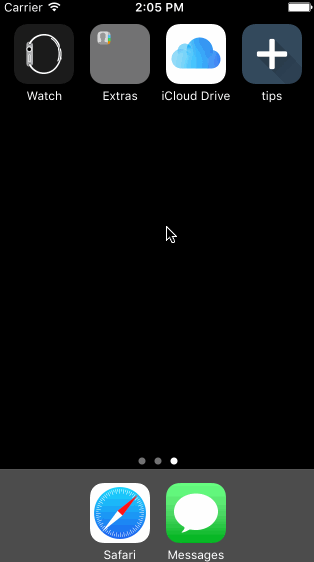

# TipCalculator

This is a Tip Calculator application for iOS and my first iOS native app that I built
for fun.

Time spent:

10 hrs

Completed:

* [x] Required: User can enter a bill amount, choose a tip percentage, and see the tip and total values.
* [x] Required: Settings page to change the default tip percentage.
* [x] Optional: Settings page to change currency and color theme.
* [x] Optional: A clear button visible to clear bill amount.
* [x] Optional: UI animation with the dollar sign every time a calculation occurs and fade in once bill field is non-empty
* [x] Optional: Ability to split bill with up to 6 people.
* [x] Optional: Ability to send text message with bill total included to remind amount owed.
* [x] Optional: Remembering bill across app restarts
* [x] Optional: Make bill field first responder with keyboard visible immediately

Notes:

1. The pay button was originally intended to use the Venmo API to allow for payments but the
API has been discontinued and instead the pay button launches an SMS on a Apple device with
the amount owed prepopulated.

Video Walkthrough:

