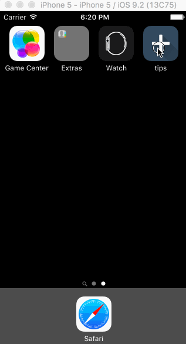

# TipCalculator

This is a Tip Calculator application for iOS and my first iOS native app that I built
for fun.

Time spent: 10 hrs

Completed:

* [] Required: User can enter a bill amount, choose a tip percentage, and see the tip and total values.
* [] Required: Settings page to change the default tip percentage.
* [] Optional: Settings page to change currency and color theme.
* [] Optional: A clear button visible to clear bill amount.
* [] Optional: UI animation with the dollar sign every time a calculation occurs.
* [] Optional: Ability to split bill with up to 6 people.
* [] Optional: Ability to send text message with bill total included to remind amount owed.

